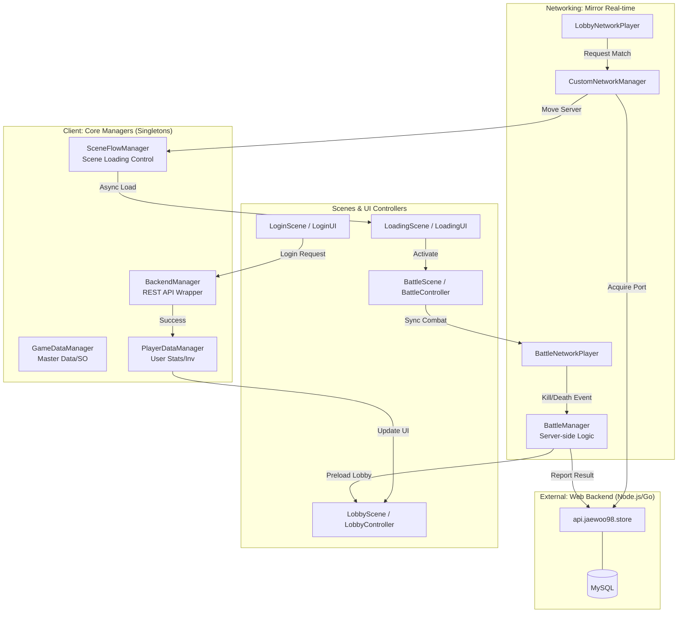

# 🏗️ Unity Dedicate Project Architecture

본 문서는 프로젝트의 전체 구조와 데이터 흐름, 네트워크 레이어 및 주요 매니저들의 역할을 설명합니다.

## 1. 시스템 아키텍처 다이어그램 (Mermaid)

---

## 2. 주요 구성 요소 및 역할

### 📋 Core Managers (Singletons)
씬이 전환되어도 파괴되지 않으며(`DontDestroyOnLoad`), 게임 전체의 상태를 관리합니다.
- **BackendManager**: REST API(HTTP)를 통해 백엔드 서버와 통신합니다. (로그인, 가챠, 매칭 포트 확보 등)
- **GameDataManager**: 아이템 정보, 캐릭터 스탯 등 변하지 않는 '마스터 데이터'를 ScriptableObject로부터 로드하여 관리합니다.
- **PlayerDataManager**: 현재 유저의 골드, 인벤토리, 레벨 등 실시간 데이터를 보유하며 서버와 동기화합니다.
- **SceneFlowManager**: 비동기 씬 로딩(`LoadingScene`)을 관리하며, 전환 시 필요한 데이터를 `LoadRequest` 객체로 전달합니다.

### 🌐 Networking Layer (Mirror)
실시간 멀티플레이어 환경을 구축하기 위한 레이어입니다.
- **CustomNetworkManager**: 로비 서버와 배틀 서버 역할을 통합 관리합니다. 명령줄 인자(`-serverType`)를 통해 서버의 역할을 결정합니다.
- **LNP (LobbyNetworkPlayer)**: 로비에서 매칭 대기 및 유저 상태를 동기화합니다.
- **BNP (BattleNetworkPlayer)**: 전투 씬에서 이동, 공격, 피격 등 실시간 전투 데이터를 동기화합니다.
- **BattleManager**: 서버 사이드에서 승패 판정, 킬/데스 집계, 경기 결과 백엔드 전송을 담당합니다.

### 🎨 UI & Controllers
- **Pull 구조**: UI가 활성화될 때 매니저로부터 데이터를 직접 가져오는 방식을 지향합니다. (결합도 감소)
- **Event-Driven**: 데이터 변경 시 `OnDataUpdated` 이벤트를 통해 관련 UI가 즉시 갱신됩니다.

---

## 3. 데이터 흐름 원칙 (Standard)
1. **정적 데이터 접근**: `GameDataManager.Instance.GetItem(id)`
2. **동적 데이터 접근**: `PlayerDataManager.Instance.GetInventory()`
3. **UI 갱신**: 매니저가 UI를 직접 갱신하지 않고, UI 컴포넌트 내부의 `OnEnable`이나 데이터 변경 이벤트를 통해 스스로 갱신합니다.

---

## 4. 씬 전환 워크플로우
1. **Login**: 유저 인증 후 `PlayerDataManager`에 기본 정보 저장.
2. **Lobby**: 인벤토리 관리, 가챠, 상점 이용 및 매칭 신청.
3. **Loading**: 매칭 성공 시 배틀 서버 주소를 받아 비동기 로딩 시작.
4. **Battle**: 실시간 전투 수행. 종료 시 결과창 표시와 동시에 로비 씬을 백그라운드에서 사전 로딩(Preload).
5. **Result**: 확인 버튼 클릭 시 이미 로딩된 로비 씬으로 즉시 전환.

  ---                                                                                                                                                                                                                                                            
  아키텍처 전체 구조                                                                                                                                                                                                                                                                                                                                                                                                                                                                                                              
  레이어 구조 (위 → 아래)                                                                                                                                                                                                                                        
                                                                                                                                                                                                                                                                 
  [씬 흐름]                                                                                                                                                                                                                                                        Boot → Login → Loading → MainLobby ↔ Gacha(AdditiveScene)                                                                                                                                                                                                                                          ↓                                                                                                                                                                                                                                                          Loading → Battle → Loading → MainLobby                                                                                                                                                                                                                                                                                                                                                                                                                                                                [글로벌 싱글턴 (DontDestroyOnLoad)]                                                                                                                                                                                                                              GameDataManager      → GameDatabase (SO) → ItemTableSO / CharacterTableSO                                                                                                                                                                                        PlayerDataManager    → PlayerData, PlayerInventory                                                                                                                                                                                                               CustomNetworkManager → Mirror 네트워크, LobbyNetworkPlayer, BattleNetworkPlayer                                                                                                                                                                                
  BackendManager       → HTTP API (static)
  SceneFlowManager     → LoadRequest (씬 전환 데이터)

  [씬별 컨트롤러]
  LoginController     → LoginUI ↔ BackendManager → PlayerDataManager
  LoadingSceneManager → LoadingUI + 서버 연결 시퀀스
  LobbyController     → LobbyUI, InventoryController, ShopController
  GachaSceneController→ TimelineController, GachaResultUI, GachaRewardDatabase
  BattleController    → BattleManager(NetworkBehaviour), SpawnManager

  [게임플레이 레이어 - NetworkBehaviour]
  PlayerController    → 이동 입력
  PlayerStats         → HP, IDamageable
  PlayerCombat        → 공격 입력 진입점
  CharacterWeapon     → 공격 판정 (Melee/Projectile), AttackDataSO x2
  CharacterStats      → 스탯 계산, CharacterDataSO
  CharacterSpawner    → 외형 스폰
  PlayerAnimationController → SyncVar + Command + ClientRpc

  [데이터 레이어]
  ScriptableObject: GameDatabase, ItemTableSO, CharacterTableSO
                    CharacterDataSO, AttackDataSO, GachaRewardDatas
  Runtime Data:     PlayerData, PlayerInventory, BattleResultData

  [인터페이스]
  IDamageable     → PlayerStats 구현
  IScoreService   → MockScoreService 구현

  [추상 클래스]
  ProjectileBase  → ExplosiveProjectile
  BaseSlot        → InventorySlot, EquipmentSlot, CharacterSlot

  ---
  핵심 데이터 흐름 3가지

  1. 로그인 흐름
  LoginUI → LoginController → BackendManager.Login()
         → PlayerDataManager.ApplyUserData() → PlayerInventory.OnChanged
         → SceneFlowManager → LoadingScene → MainLobby

  2. 배틀 판정 흐름
  Input → PlayerCombat → CharacterWeapon.CmdUseAttack() [서버]
        → PerformMelee()/PerformProjectile()
        → IDamageable.TakeDamage() → PlayerStats
        → BattleManager.RecordDamage/OnPlayerDead()
        → RpcShowResultAndPreload() [모든 클라이언트]

  3. 뽑기 흐름
  ShopUI → ShopController → BackendManager.GachaDraw()
         → GachaContext.PendingResults = results
         → GachaContext.OnGachaResult.Invoke()
         → GachaSceneController → TimelineController → GachaResultUI

  ---
  주요 패턴 요약/compact

  ┌──────────────────┬─────────────────────────────────────────────────────────────────────────────────────────────────┐
  │       패턴       │                                           사용 클래스                                           │
  ├──────────────────┼─────────────────────────────────────────────────────────────────────────────────────────────────┤
  │ Singleton        │ GameDataManager, PlayerDataManager, BattleManager, LobbyController, ShopController 등 11개      │
  ├──────────────────┼─────────────────────────────────────────────────────────────────────────────────────────────────┤
  │ ScriptableObject │ GameDatabase, CharacterDataSO, AttackDataSO, ItemTableSO 등 (Dict로 O(1) 조회)                  │
  ├──────────────────┼─────────────────────────────────────────────────────────────────────────────────────────────────┤
  │ Mirror SyncVar   │ PlayerStats.hp, CharacterStats.level, PlayerAnimationController 파라미터                        │
  ├──────────────────┼─────────────────────────────────────────────────────────────────────────────────────────────────┤
  │ Action 이벤트    │ PlayerInventory.OnChanged, PlayerDataManager.OnDataUpdated, CharacterSpawner.OnCharacterSpawned │
  ├──────────────────┼─────────────────────────────────────────────────────────────────────────────────────────────────┤
  │ Command/RPC      │ CharacterWeapon.CmdUseAttack → RpcPlayAttack                                                    │
  ├──────────────────┼─────────────────────────────────────────────────────────────────────────────────────────────────┤
  │ Interface        │ IDamageable, IScoreService                                                                      │
  ├──────────────────┼─────────────────────────────────────────────────────────────────────────────────────────────────┤
  │ Abstract         │ ProjectileBase, BaseSlot                                                                        │
  └──────────────────┴─────────────────────────────────────────────────────────────────────────────────────────────────┘